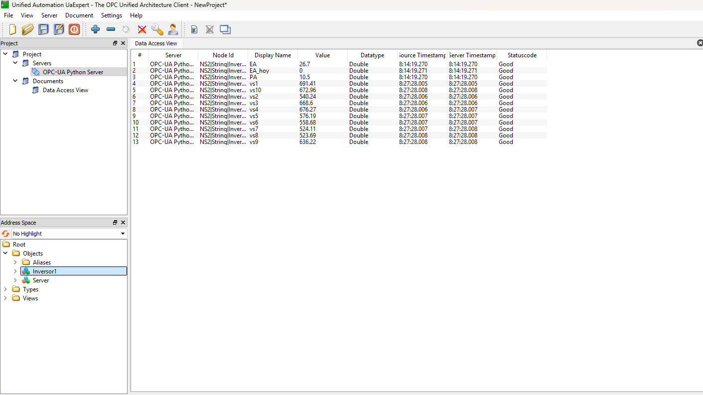

# Servidor OPC-UA

### 0. Introducción

En este docker se creará un servidor OPC-UA sin encriptación y anónimo en Python3 con la librería "asyncua".

#### Inversor

| Objeto | Id | TipoDato |
| :----: | :----: | :----: |
| PA | ns=2;s=Inversor1.PA | Doble |
| PA_peak | ns=2;s=Inversor1.PA_peak | Doble |
| EA | ns=2;s=Inversor1.EA | Doble |
| EA_hoy | ns=2;s=Inversor1.EA_hoy | Doble |
| Estado | ns=2;s=Inversor1.Estado | Int |
| Temperatura | ns=2;s=Inversor1.Temperatura | Doble |
| Raislamiento | ns=2;s=Inversor1.Raislamiento | Doble |
| V1 | ns=2;s=Inversor1.V1 | Doble |
| V2 | ns=2;s=Inversor1.V2 | Doble |
| V3 | ns=2;s=Inversor1.V3 | Doble |
| I1 | ns=2;s=Inversor1.I1 | Doble |
| I2 | ns=2;s=Inversor1.I2 | Doble |
| I3 | ns=2;s=Inversor1.I3 | Doble |
| Vs1 | ns=2;s=Inversor1.vs1 | Doble |
| Vs2 | ns=2;s=Inversor1.vs2 | Doble |
| Vs3 | ns=2;s=Inversor1.vs3 | Doble |
| Vs4 | ns=2;s=Inversor1.vs4 | Doble |
| Vs5 | ns=2;s=Inversor1.vs5 | Doble |
| Vs6 | ns=2;s=Inversor1.vs6 | Doble |
| Vs7 | ns=2;s=Inversor1.vs7 | Doble |
| Vs8 | ns=2;s=Inversor1.vs8 | Doble |
| Vs9 | ns=2;s=Inversor1.vs9 | Doble |
| Vs10 | ns=2;s=Inversor1.vs10 | Doble |
| Is1 | ns=2;s=Inversor1.is1 | Doble |
| Is2 | ns=2;s=Inversor1.is2 | Doble |
| Is3 | ns=2;s=Inversor1.is3 | Doble |
| Is4 | ns=2;s=Inversor1.is4 | Doble |
| Is5 | ns=2;s=Inversor1.is5 | Doble |
| Is6 | ns=2;s=Inversor1.is6 | Doble |
| Is7 | ns=2;s=Inversor1.is7 | Doble |
| Is8 | ns=2;s=Inversor1.is8 | Doble |
| Is9 | ns=2;s=Inversor1.is9 | Doble |
| Is10 | ns=2;s=Inversor1.is10 | Doble |

#### AARR

| Objeto | Id | TipoDato |
| :----: | :----: | :----: |
| PA | ns=2;s=AARR1.PA | Doble |
| PA1 | ns=2;s=AARR1.PA1 | Doble |
| PA2 | ns=2;s=AARR1.PA2 | Doble |
| PA3 | ns=2;s=AARR1.PA3 | Doble |
| EA | ns=2;s=AARR1.EA | Doble |
| V1 | ns=2;s=AARR1.V1 | Doble |
| V2 | ns=2;s=AARR1.V2 | Doble |
| V3 | ns=2;s=AARR1.V3 | Doble |
| I1 | ns=2;s=AARR1.I1 | Doble |
| I2 | ns=2;s=AARR1.I2 | Doble |
| I3 | ns=2;s=AARR1.I3 | Doble |

#### EMI

| Objeto | Id | TipoDato |
| :----: | :----: | :----: |
| Rad1 | ns=2;s=EMI1.Rad1 | Doble |
| Rad2 | ns=2;s=EMI1.Rad2 | Doble |
| T_amb | ns=2;s=EMI1.T_amb | Doble |
| T_panel | ns=2;s=EMI1.T_panel | Doble |

### 1. Microservicios empleados

| Microservicio      | Descripción | Puerto | GUI |
| :----:             |    :----:   |    :----:   |   :----:   |
| Server    | Servidor OPC-UA        | 4840 | - |
| BBDD    | Postgres        | 5432 | - |
| API   | API  | 8888 | http://localhost/docs |
| Jupyter Notebook   | Plataforma web para realizar operar OPC-UA como cliente  | 8888 | http://localhost:8888 |
| nifi   | nifi | 8088 | http://localhost:8088/nifi/ |

### 2. Levantar los contenedores
```docker compose up -d```

### 3. Comprobamos que se ha montado correctamente el servidor OPC-UA

Cuando se accede al servidor se pueden ver los objetos creados y leer el valor actual y escribirlos. 

